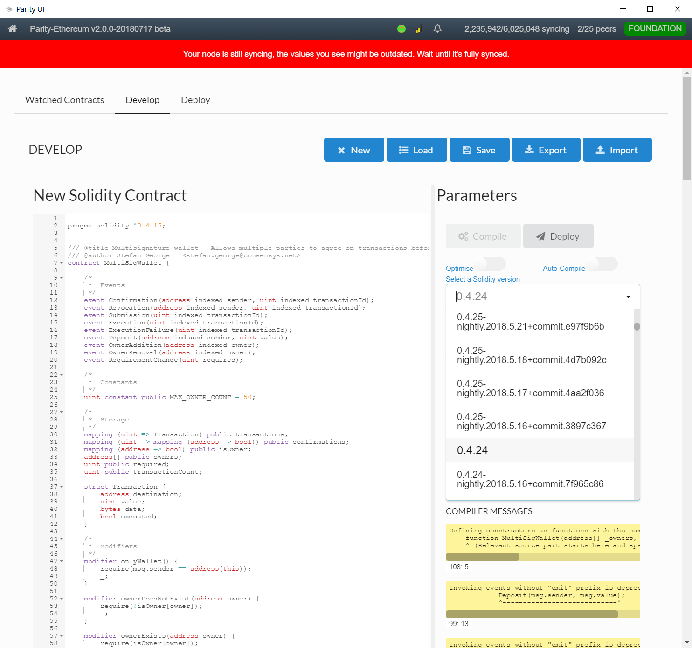
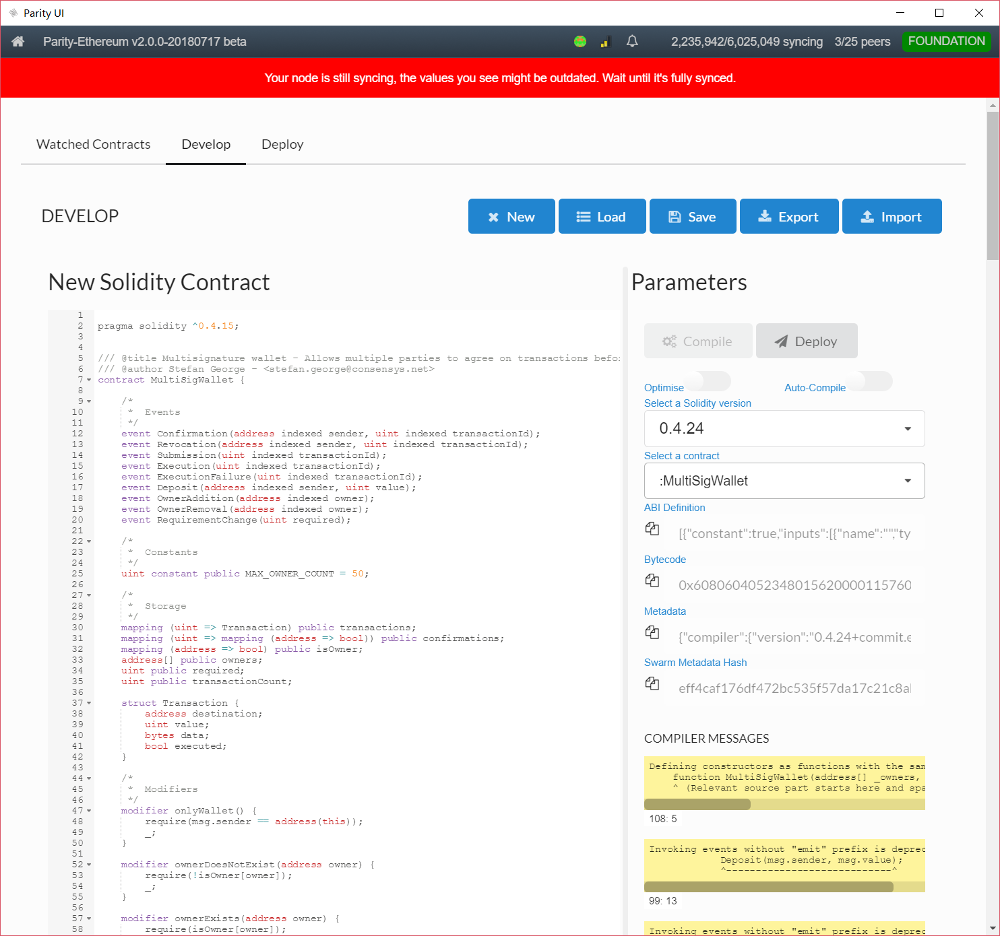
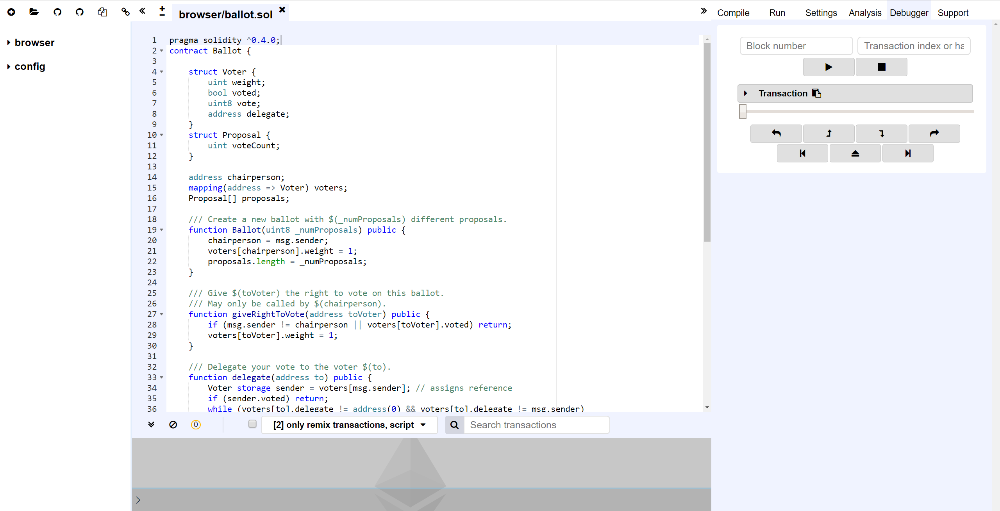

# 1. 以太坊智能合约

<!-- TOC -->

- [1. 以太坊智能合约](#1-以太坊智能合约)
    - [1.1. Parity](#11-parity)
    - [1.2. Ethereum Wallet](#12-ethereum-wallet)
    - [1.3. Remix](#13-remix)
        - [1.3.1. 主界面](#131-主界面)
        - [1.3.2. 智能合约调试](#132-智能合约调试)
        - [1.3.3. 智能合约运行](#133-智能合约运行)
        - [1.3.4. 智能合约分析](#134-智能合约分析)

<!-- /TOC -->

## 1.1. Parity

> https://www.parity.io/

## 1.2. Ethereum Wallet

> https://github.com/ethereum/mist/releases/

## 1.3. Remix

> https://remix.ethereum.org/

### 1.3.1. 主界面

### 1.3.2. 智能合约调试

### 1.3.3. 智能合约运行

### 1.3.4. 智能合约分析

