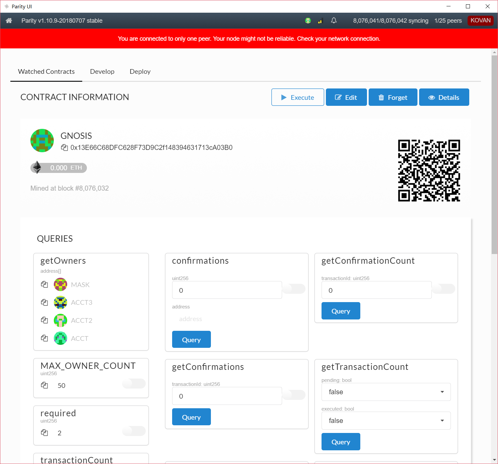
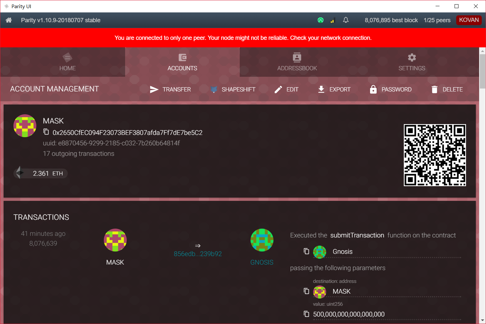

# 1. 以太坊Parity多重签名设计

<!-- TOC -->

- [1. 以太坊Parity多重签名设计](#1-%E4%BB%A5%E5%A4%AA%E5%9D%8Aparity%E5%A4%9A%E9%87%8D%E7%AD%BE%E5%90%8D%E8%AE%BE%E8%AE%A1)
    - [1.1. 使用体验](#11-%E4%BD%BF%E7%94%A8%E4%BD%93%E9%AA%8C)
        - [1.1.1. 界面](#111-%E7%95%8C%E9%9D%A2)
        - [1.1.2. 助记词](#112-%E5%8A%A9%E8%AE%B0%E8%AF%8D)
    - [1.2. 多重签名](#12-%E5%A4%9A%E9%87%8D%E7%AD%BE%E5%90%8D)
        - [1.2.1. Wallet.sol文件](#121-walletsol%E6%96%87%E4%BB%B6)
            - [1.2.1.1. 文件结构](#1211-%E6%96%87%E4%BB%B6%E7%BB%93%E6%9E%84)
            - [1.2.1.2. multiowned合约](#1212-multiowned%E5%90%88%E7%BA%A6)
            - [1.2.1.3. multisig合约](#1213-multisig%E5%90%88%E7%BA%A6)
            - [1.2.1.4. daylimit合约](#1214-daylimit%E5%90%88%E7%BA%A6)
        - [1.2.2. 多签钱包的部署](#122-%E5%A4%9A%E7%AD%BE%E9%92%B1%E5%8C%85%E7%9A%84%E9%83%A8%E7%BD%B2)
        - [1.2.3. 多签钱包的使用](#123-%E5%A4%9A%E7%AD%BE%E9%92%B1%E5%8C%85%E7%9A%84%E4%BD%BF%E7%94%A8)
            - [1.2.3.1. getOwner与isOwner的使用](#1231-getowner%E4%B8%8Eisowner%E7%9A%84%E4%BD%BF%E7%94%A8)
            - [1.2.3.2. setDailyLimit](#1232-setdailylimit)
            - [1.2.3.3. 向多签钱包转账](#1233-%E5%90%91%E5%A4%9A%E7%AD%BE%E9%92%B1%E5%8C%85%E8%BD%AC%E8%B4%A6)
            - [1.2.3.4. 更改多签方案](#1234-%E6%9B%B4%E6%94%B9%E5%A4%9A%E7%AD%BE%E6%96%B9%E6%A1%88)
    - [1.3. 多签示例](#13-%E5%A4%9A%E7%AD%BE%E7%A4%BA%E4%BE%8B)

<!-- /TOC -->

## 1.1. 使用体验

### 1.1.1. 界面

个人认为Parity的界面并不美观。


### 1.1.2. 助记词

Parity的助记词只能逐一输入，体验不佳。对比来看，ONTO的助记词是在所给助记词中选择顺序，用户体验比较好。


## 1.2. 多重签名

Parity的多重签名基于智能合约`Wallet.sol`实现。

### 1.2.1. Wallet.sol文件

#### 1.2.1.1. 文件结构

> https://github.com/ethereum/dapp-bin/blob/master/wallet/wallet.sol

`Wallet.sol`中包含了4个合约（contract）：

- Wallet.sol
  - contract multiowned
  - contract daylimit
  - contract multisig
  - contract Wallet


#### 1.2.1.2. multiowned合约

`multiowned`合约定义了6种事件（Event）：

```
event Confirmation(address owner, bytes32 operation);
event Revoke(address owner, bytes32 operation);
event OwnerChanged(address oldOwner, address newOwner);
event OwnerAdded(address newOwner);
event OwnerRemoved(address oldOwner);
event RequirementChanged(uint newRequirement);
```

- `OwnerAdded`：用于记录增加钱包所有人操作。
- `OwnerRemoved`：用于记录删除钱包所有人操作。
- `OwnerChanged`：用于记录修改钱包所有人操作。
- `RequirementChanged`：用于记录修改多重签名方案（M-N）操作。

#### 1.2.1.3. multisig合约

`contract multisig`合约定义了4种事件：

```
event Deposit(address _from, uint value);
event SingleTransact(address owner, uint value, address to, bytes data);
event MultiTransact(address owner, bytes32 operation, uint value, address to, bytes data);
event ConfirmationNeeded(bytes32 operation, address initiator, uint value, address to, bytes data);
```    

- `Deposit`：用于记录多签钱包中实际存有的资金数量。
- `SingleTransact`：用于记录从多签钱包中发起的单签交易的相关信息：签名者、资金数量、资金流向、操作的哈希值。
- `MultiTransact`：用于记录从多签钱包中发起的多签交易的相关信息：最终签名者、资金数量、资金流向、操作的哈希值。
- `ConfirmationNeeded`：用于记录多签钱包中发起一笔交易还需要的签名数量。

#### 1.2.1.4. daylimit合约

`daylimit`合约未定义事件，提供了5个方法：

```
function daylimit(uint _limit)
function setDailyLimit(uint _newLimit)
function resetSpentToday()
function underLimit(uint _value)
function today()
```

- `function daylimit(uint _limit)`：检查今天是否还有可用花费。
- `function setDailyLimit(uint _newLimit)`：设置每日花费限额（需要多重签名使其生效）。
- `function resetSpentToday()`：重置今天已经产生的花费（需要多重签名使其生效）。
- `function underLimit(uint _value)`：
- `function today()`：确定今天的索引。

### 1.2.2. 多签钱包的部署


在实际部署时，`Parity UI`中提供的智能合约编译器在`Kovan`测试网中一直无法加载出来，故最终使用了[Remix](https://remix.ethereum.org/)进行智能合约的编译。


### 1.2.3. 多签钱包的使用

#### 1.2.3.1. getOwner与isOwner的使用


#### 1.2.3.2. setDailyLimit


#### 1.2.3.3. 向多签钱包转账


#### 1.2.3.4. 更改多签方案

将多签钱包更改为3-2多签钱包（`m_numOwners`：3，`m_required`：2）：


## 1.3. 多签示例

如图所示，多签钱包`GNOSIS`存在4个所有者：`MASK`、`ACCT`、`ACCT2`、`ACCT3`。



`MASK`向多签钱包`GNOSIS`转账：


`Gas`相关设置：


`MetaMask`确认交易：


交易发送到网络中：


交易显示为未执行：


确认数为`1`：


`MASK`钱包中查询到交易记录，但交易并未执行：



发送交易：


确认交易：


交易被发送到网络中：


交易被写入区块，确认数更新为2：


多签钱包余额更新为0.3ETH，交易显示为已执行：


