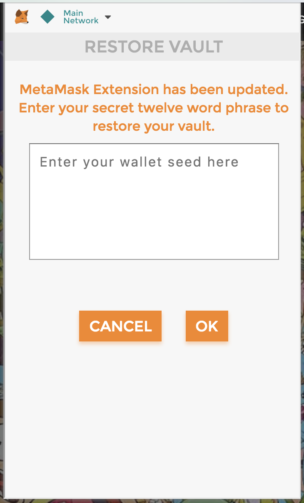
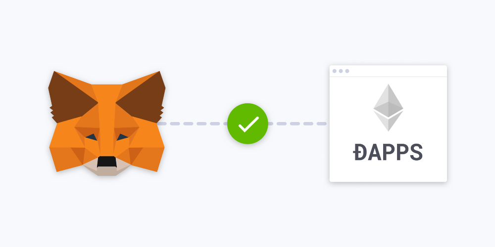
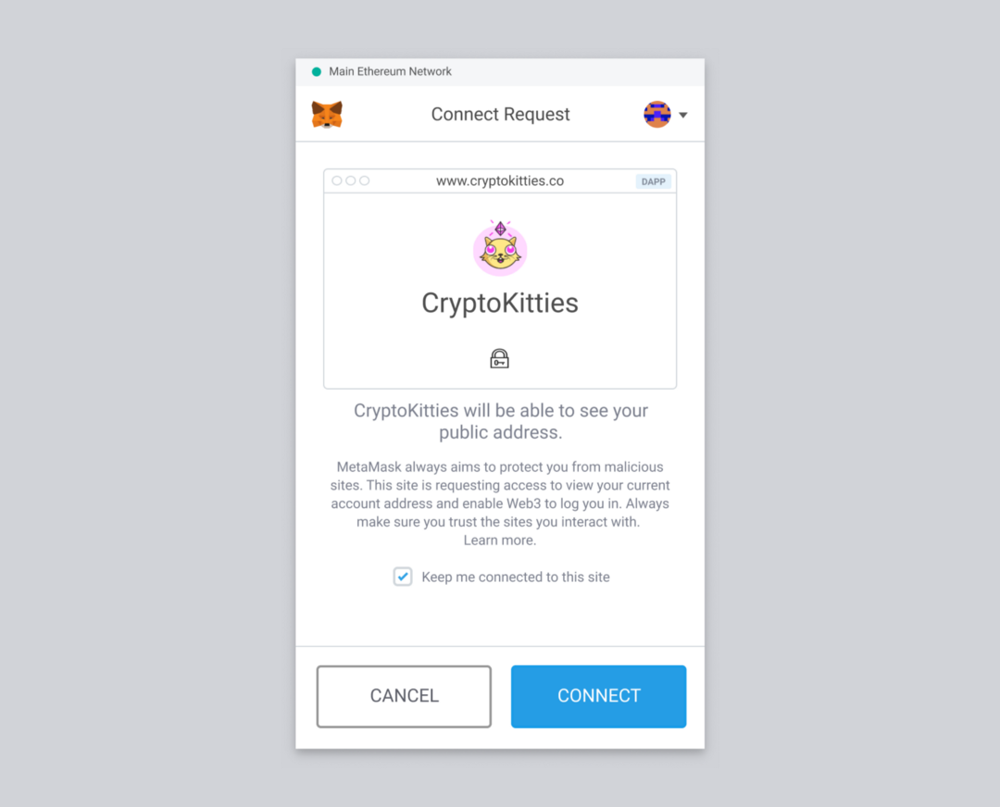

# EIP-1102

<!-- TOC -->

- [EIP-1102](#eip-1102)
    - [Phishing Strategy](#phishing-strategy)
    - [概览](#%E6%A6%82%E8%A7%88)
    - [UI草图](#ui%E8%8D%89%E5%9B%BE)
    - [内容](#%E5%86%85%E5%AE%B9)
        - [Simple summary](#simple-summary)
        - [Abstract](#abstract)
        - [Typical dapp initialization](#typical-dapp-initialization)
        - [Proposed dapp initialization](#proposed-dapp-initialization)
        - [Example implementation: `postMessage`](#example-implementation-postmessage)
        - [Constraints](#constraints)
        - [Immediate value-add](#immediate-value-add)
        - [Long-term value-add](#long-term-value-add)
        - [MVP implementation](#mvp-implementation)

<!-- /TOC -->

## Phishing Strategy



## 概览

从2018年11月2日起，`MetaMask`和其他`Dapp浏览器`将停止自动注入`web3`。相反，`Dapp`应该使用新的`postMessage API`请求访问权限。



## UI草图



## 内容

> https://github.com/ethereum/EIPs/blob/master/EIPS/eip-1102.md

### Simple summary

This proposal describes a way for DOM environments to expose an Ethereum provider API that requires user approval.

### Abstract

上一代支持以太坊的DOM环境遵循一种模式，即在未经用户同意的情况下将`provider object`直接注入DOM。这会将此类环境的用户暴露给指纹攻击，因为不受信任的网站可以检查注入的`provider`并且可靠地识别支持以太坊的客户端。

The previous generation of Ethereum-enabled DOM environments follows a pattern of directly injecting a provider object into the DOM without user consent. This exposes users of such environments to fingerprinting attacks since untrusted websites can check for the injected provider and reliably identify Ethereum-enabled clients.

该提案概述了一种`Dapps`请求访问以太`provider API`的协议。

This proposal outlines a protocol in which dapps request access to an Ethereum provider API.

### Typical dapp initialization

```js
START dapp
IF web3 is defined
    CONTINUE dapp
IF web3 is undefined
    STOP dapp
```

### Proposed dapp initialization

```js
START dapp
REQUEST[1] Ethereum provider
IF user approves
    INJECT[2] provider API
    NOTIFY[3] dapp
    CONTINUE dapp
IF user rejects
IF non-Ethereum environment
    NOOP[4]
```

### Example implementation: `postMessage`

下面的例子展示了在基于浏览器的DOM环境中该方案的一种可能实现。请注意，其他平台上的以太坊的环境很可能使用与平台相关的本机消息传递协议，而不是`postMessage`。

The following example demonstrates one possible implementation of this strategy in a browser-based DOM environment. Note that Ethereum-enabled environments on other platforms would most likely use platform-specific native messaging protocols, not `postMessage`.

```js
window.addEventListener('load', () => {
    // Listen for provider injection
    window.addEventListener('message', ({ data }) => {
        if (data && data.type && data.type === 'ETHEREUM_PROVIDER_SUCCESS') {
            // Provider API exposed, continue
            const networkVersion = await ethereum.send('net_version', []);
        }
    });
    // Request provider
    window.postMessage({ type: 'ETHEREUM_PROVIDER_REQUEST' }, '*');
});
```

### Constraints

- 默认情况下，`provider API`不得暴露给网站。
  
  A provider API MUST NOT be exposed to websites by default.

- 如果不存在`provider API`，Dapps必须请求`provider API`.

  Dapps MUST request a provider API if it does not exist.

- 用户必须能够同意或者拒绝对`provider API`的访问。
  
  Users MUST be able to approve or reject provider API access.

- 用户同意后，必须向web站点暴露`provider API`.
  
  A provider API MUST be exposed to websites after user consent.

- 如果用户可以选择退出，则环境可以继续自动暴露`provider API`。
  
  Environments MAY continue auto-exposing a provider API if users can opt-out.

### Immediate value-add

- 用户可以拒绝不受信任的站点对`provider API`的访问，以防止指纹技术（Users can reject provider API access on untrusted sites to prevent fingerprinting）。

### Long-term value-add

- 在用户同意的基础上，`Dapps`可以请求特定的帐户信息。
  
  Dapps could request specific account information based on user consent.

- 在用户同意的基础上，`Dapps`可以请求特定的用户信息(uPort, DIDs)。
  
  Dapps could request specific user information based on user consent (uPort, DIDs).

- 在用户同意的基础上，`Dapps`可以请求特定的网络。
  
  Dapps could request a specific network based on user consent.

- 在用户同意的基础上，`Dapps`可以请求特定的多个实例。
  
  Dapps could request multiple instances of the above based on user consent.

### MVP implementation

The MetaMask team is currently working an [MVP implementation](https://github.com/MetaMask/metamask-extension/pull/4703) of the strategy described above and expects to begin limited user testing soon.

New dapp startup flow:

- Dapp请求访问`provide`

  Dapp requests provider access

- 向用户显示同意页面

  User is presented with approval screen

- 如果用户批准，`provider`被注入，`Dapp`被通知
  
  If user approves, provider injected, dapp notified

- 如果用户拒绝，则不会发生任何事情（防止基于拒绝的指纹识别）

  If user rejects, nothing happens (prevents rejection-based fingerprinting)

- 为方便起见，已经被批准的域将被缓存
  
  For convenience, approved domains are cached
