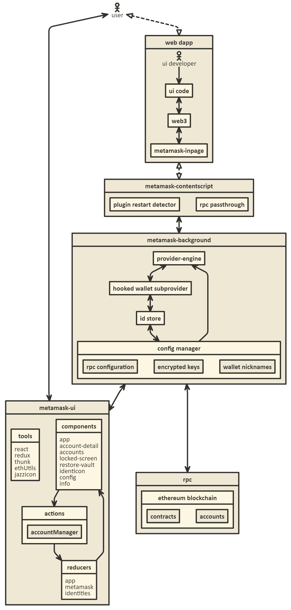

# MetaMask Architecture

## 架构



> https://github.com/MetaMask/metamask-extension

The `metamask-background` describes the file at [`app/scripts/background.js`](https://github.com/MetaMask/metamask-extension/blob/develop/app/scripts/background.js), which is the web extension singleton. 

The `metamask-background` instantiates an instance of the `MetaMask Controller`, which represents the user's accounts, a connection to the blockchain, and the interaction with new Dapps.

When a new site is visited, the WebExtension creates a new `ContentScript` in that page's context, which can be seen at `app/scripts/contentscript.js`.

MetaMask's most unique feature isn't being a wallet, it's providing an Ethereum-enabled JavaScript context to websites.

## Ports, streams, and Web3!

MetaMask has two kinds of [duplex stream APIs](https://github.com/substack/stream-handbook#duplex) that it exposes:

- [metamask-controller(connectionStream, originDomain)](https://github.com/MetaMask/metamask-extension/blob/master/app/scripts/metamask-controller.js#L352): 用于通过一个远程端口连接用户界面。

- [metamask.setupUntrustedCommunication(connectionStream, originDomain)](https://github.com/MetaMask/metamask-extension/blob/master/app/scripts/metamask-controller.js#L337)：用于将一个新的`web`站点的`web3 API`连接到`MetaMask`的区块链链接（originDomain用于阻止钓鱼网站）。

### metamask-controller

```js
/**
   * Returns an Object containing API Callback Functions.
   * These functions are the interface for the UI.
   * The API object can be transmitted over a stream with dnode.
   *
   * @returns {Object} Object containing API functions.
   */
getApi () {
    const keyringController = this.keyringController
    const preferencesController = this.preferencesController
    const txController = this.txController
    const noticeController = this.noticeController
    const addressBookController = this.addressBookController
    const networkController = this.networkController

    return {
        // etc
        getState: (cb) => cb(null, this.getState()),
        setCurrentCurrency: this.setCurrentCurrency.bind(this),
        setUseBlockie: this.setUseBlockie.bind(this),
        setCurrentLocale: this.setCurrentLocale.bind(this),
        markAccountsFound: this.markAccountsFound.bind(this),
        markPasswordForgotten: this.markPasswordForgotten.bind(this),
        unMarkPasswordForgotten: this.unMarkPasswordForgotten.bind(this),
        getGasPrice: (cb) => cb(null, this.getGasPrice()),

        // coinbase
        buyEth: this.buyEth.bind(this),
        // shapeshift
        createShapeShiftTx: this.createShapeShiftTx.bind(this),

        // primary HD keyring management
        addNewAccount: nodeify(this.addNewAccount, this),
        placeSeedWords: this.placeSeedWords.bind(this),
        verifySeedPhrase: nodeify(this.verifySeedPhrase, this),
        clearSeedWordCache: this.clearSeedWordCache.bind(this),
        resetAccount: nodeify(this.resetAccount, this),
        removeAccount: nodeify(this.removeAccount, this),
        importAccountWithStrategy: nodeify(this.importAccountWithStrategy, this),

        // hardware wallets
        connectHardware: nodeify(this.connectHardware, this),
        forgetDevice: nodeify(this.forgetDevice, this),
        checkHardwareStatus: nodeify(this.checkHardwareStatus, this),

        // TREZOR
        unlockTrezorAccount: nodeify(this.unlockTrezorAccount, this),

        // vault management
        submitPassword: nodeify(this.submitPassword, this),

        // network management
        setProviderType: nodeify(networkController.setProviderType, networkController),
        setCustomRpc: nodeify(this.setCustomRpc, this),

        // PreferencesController
        setSelectedAddress: nodeify(preferencesController.setSelectedAddress, preferencesController),
        addToken: nodeify(preferencesController.addToken, preferencesController),
        removeToken: nodeify(preferencesController.removeToken, preferencesController),
        setCurrentAccountTab: nodeify(preferencesController.setCurrentAccountTab, preferencesController),
        setAccountLabel: nodeify(preferencesController.setAccountLabel, preferencesController),
        setFeatureFlag: nodeify(preferencesController.setFeatureFlag, preferencesController),

        // AddressController
        setAddressBook: nodeify(addressBookController.setAddressBook, addressBookController),

        // KeyringController
        setLocked: nodeify(keyringController.setLocked, keyringController),
        createNewVaultAndKeychain: nodeify(this.createNewVaultAndKeychain, this),
        createNewVaultAndRestore: nodeify(this.createNewVaultAndRestore, this),
        addNewKeyring: nodeify(keyringController.addNewKeyring, keyringController),
        exportAccount: nodeify(keyringController.exportAccount, keyringController),

        // txController
        cancelTransaction: nodeify(txController.cancelTransaction, txController),
        updateTransaction: nodeify(txController.updateTransaction, txController),
        updateAndApproveTransaction: nodeify(txController.updateAndApproveTransaction, txController),
        retryTransaction: nodeify(this.retryTransaction, this),
        getFilteredTxList: nodeify(txController.getFilteredTxList, txController),
        isNonceTaken: nodeify(txController.isNonceTaken, txController),
        estimateGas: nodeify(this.estimateGas, this),

        // messageManager
        signMessage: nodeify(this.signMessage, this),
        cancelMessage: this.cancelMessage.bind(this),

        // personalMessageManager
        signPersonalMessage: nodeify(this.signPersonalMessage, this),
        cancelPersonalMessage: this.cancelPersonalMessage.bind(this),

        // personalMessageManager
        signTypedMessage: nodeify(this.signTypedMessage, this),
        cancelTypedMessage: this.cancelTypedMessage.bind(this),

        // notices
        checkNotices: noticeController.updateNoticesList.bind(noticeController),
        markNoticeRead: noticeController.markNoticeRead.bind(noticeController),
    }
}


```

> https://github.com/MetaMask/metamask-extension/blob/master/app/scripts/metamask-controller.js#L352

### Identity Management (signature operations)

```js
// eth_sign methods:

/**
* Called when a Dapp uses the eth_sign method, to request user approval.
* eth_sign is a pure signature of arbitrary data. It is on a deprecation
* path, since this data can be a transaction, or can leak private key
* information.
*
* @param {Object} msgParams - The params passed to eth_sign.
* @param {Function} cb = The callback function called with the signature.
*/
newUnsignedMessage (msgParams, cb) {
const msgId = this.messageManager.addUnapprovedMessage(msgParams)
this.sendUpdate()
this.opts.showUnconfirmedMessage()
this.messageManager.once(`${msgId}:finished`, (data) => {
    switch (data.status) {
    case 'signed':
        return cb(null, data.rawSig)
    case 'rejected':
        return cb(cleanErrorStack(new Error('MetaMask Message Signature: User denied message signature.')))
    default:
        return cb(cleanErrorStack(new Error(`MetaMask Message Signature: Unknown problem: ${JSON.stringify(msgParams)}`)))
    }
})
}

/**
* Signifies user intent to complete an eth_sign method.
*
* @param  {Object} msgParams The params passed to eth_call.
* @returns {Promise<Object>} Full state update.
*/
signMessage (msgParams) {
log.info('MetaMaskController - signMessage')
const msgId = msgParams.metamaskId

// sets the status op the message to 'approved'
// and removes the metamaskId for signing
return this.messageManager.approveMessage(msgParams)
.then((cleanMsgParams) => {
    // signs the message
    return this.keyringController.signMessage(cleanMsgParams)
})
.then((rawSig) => {
    // tells the listener that the message has been signed
    // and can be returned to the dapp
    this.messageManager.setMsgStatusSigned(msgId, rawSig)
    return this.getState()
})
}

/**
* Used to cancel a message submitted via eth_sign.
*
* @param {string} msgId - The id of the message to cancel.
*/
cancelMessage (msgId, cb) {
const messageManager = this.messageManager
messageManager.rejectMsg(msgId)
if (cb && typeof cb === 'function') {
    cb(null, this.getState())
}
}
```

### personal_sign methods

```js
/**
* Called when a dapp uses the personal_sign method.
* This is identical to the Geth eth_sign method, and may eventually replace
* eth_sign.
*
* We currently define our eth_sign and personal_sign mostly for legacy Dapps.
*
* @param {Object} msgParams - The params of the message to sign & return to the Dapp.
* @param {Function} cb - The callback function called with the signature.
* Passed back to the requesting Dapp.
*/
newUnsignedPersonalMessage (msgParams, cb) {
if (!msgParams.from) {
    return cb(cleanErrorStack(new Error('MetaMask Message Signature: from field is required.')))
}

const msgId = this.personalMessageManager.addUnapprovedMessage(msgParams)
this.sendUpdate()
this.opts.showUnconfirmedMessage()
this.personalMessageManager.once(`${msgId}:finished`, (data) => {
    switch (data.status) {
    case 'signed':
        return cb(null, data.rawSig)
    case 'rejected':
        return cb(cleanErrorStack(new Error('MetaMask Message Signature: User denied message signature.')))
    default:
        return cb(cleanErrorStack(new Error(`MetaMask Message Signature: Unknown problem: ${JSON.stringify(msgParams)}`)))
    }
})
}

/**
* Signifies a user's approval to sign a personal_sign message in queue.
* Triggers signing, and the callback function from newUnsignedPersonalMessage.
*
* @param {Object} msgParams - The params of the message to sign & return to the Dapp.
* @returns {Promise<Object>} - A full state update.
*/
signPersonalMessage (msgParams) {
log.info('MetaMaskController - signPersonalMessage')
const msgId = msgParams.metamaskId
// sets the status op the message to 'approved'
// and removes the metamaskId for signing
return this.personalMessageManager.approveMessage(msgParams)
.then((cleanMsgParams) => {
    // signs the message
    return this.keyringController.signPersonalMessage(cleanMsgParams)
})
.then((rawSig) => {
    // tells the listener that the message has been signed
    // and can be returned to the dapp
    this.personalMessageManager.setMsgStatusSigned(msgId, rawSig)
    return this.getState()
})
}

/**
* Used to cancel a personal_sign type message.
* @param {string} msgId - The ID of the message to cancel.
* @param {Function} cb - The callback function called with a full state update.
*/
cancelPersonalMessage (msgId, cb) {
const messageManager = this.personalMessageManager
messageManager.rejectMsg(msgId)
if (cb && typeof cb === 'function') {
    cb(null, this.getState())
}
}

```

### stream-handbook

> [This document](https://github.com/substack/stream-handbook) covers the basics of how to write node.js programs with streams.