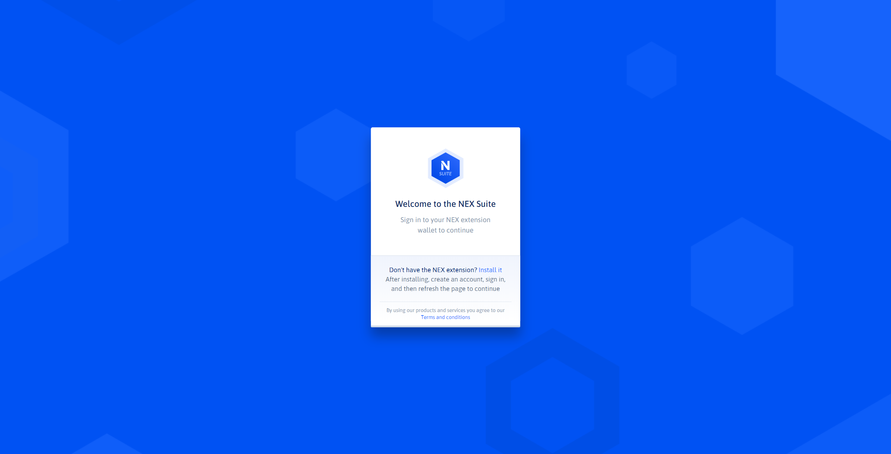
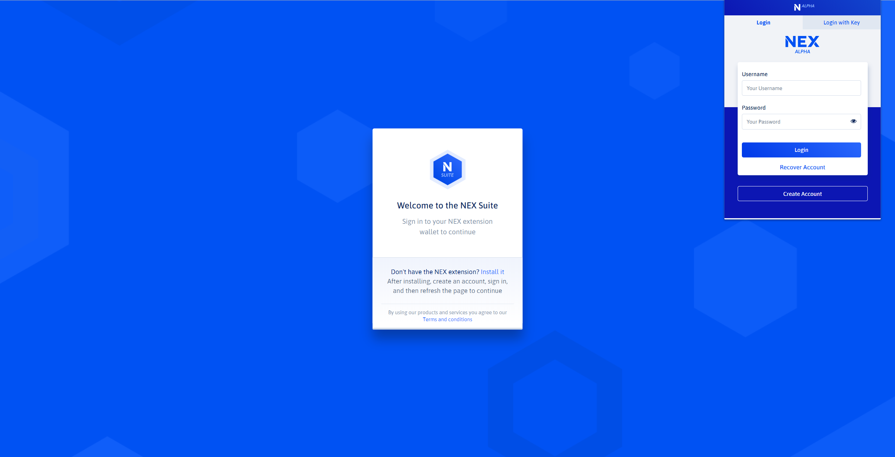
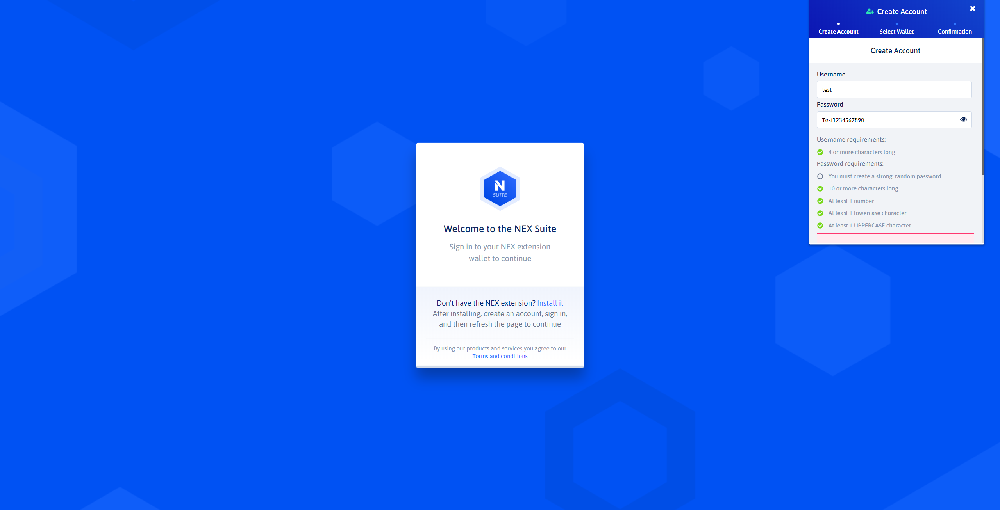
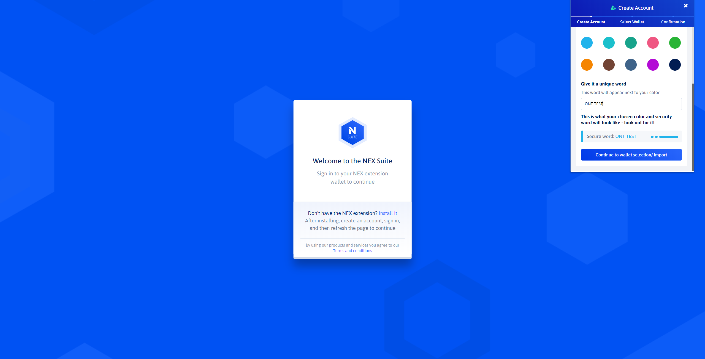
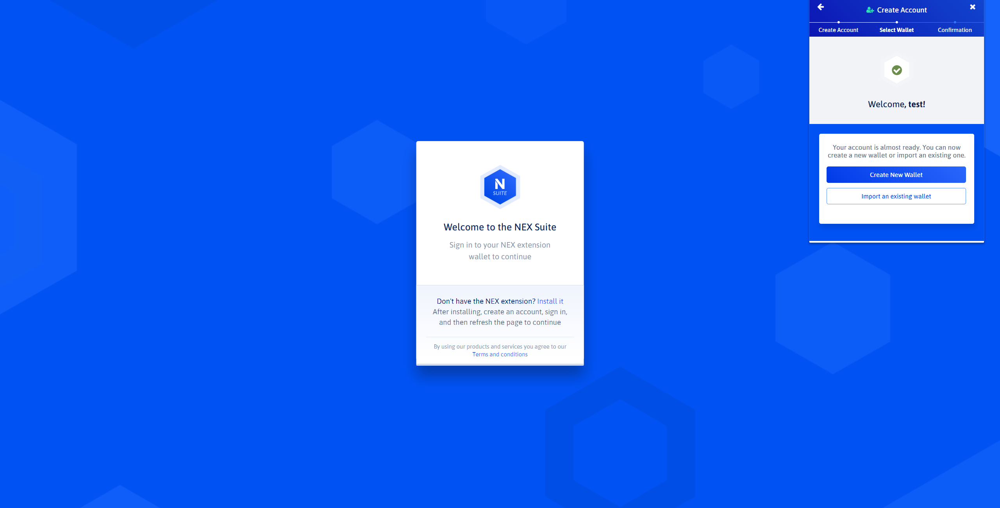
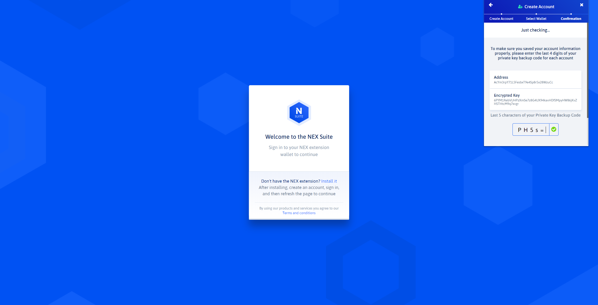
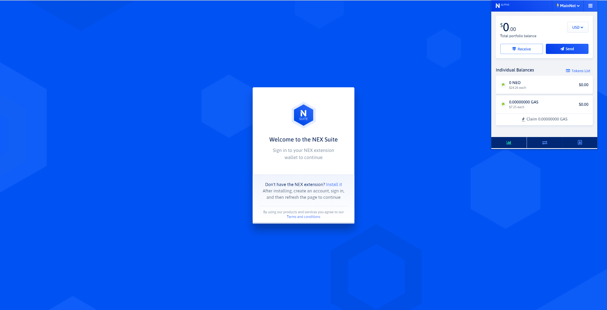
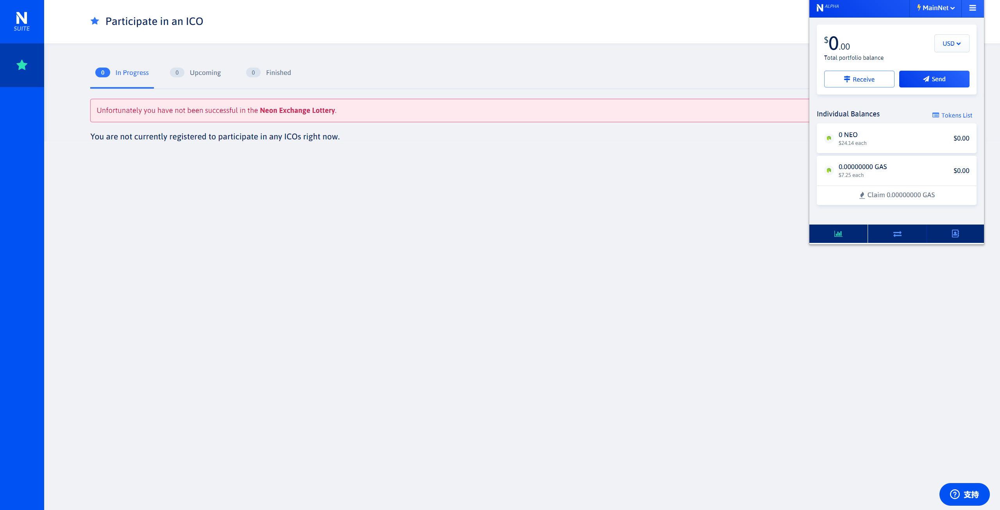

# NEX Extension

> https://github.com/neonexchange/nex-extension-alpha

## 项目概览

- NEXExtension: 插件实现

> https://github.com/neonexchange/nex-extension-alpha/tree/master/NEXExtension

- NEXExtensionClient: 用于与NEX Extension进行交互

> https://github.com/neonexchange/nex-extension-alpha/tree/master/NEXExtensionClient

## NEXExtensionClient使用示例

```js
const nexExtApi = new NEXExtensionClient()

// Start a transaction
nexExtApi.startTx({
  amount: '1.5',
  symbol: 'GAS',
  toAddr: 'AWmzT3dqJDTucBmv4X7TXNsbqQMioMGt6L'
})

// Open receive modal
nexExtApi.openReceive()
```

## NEXExtension使用

















