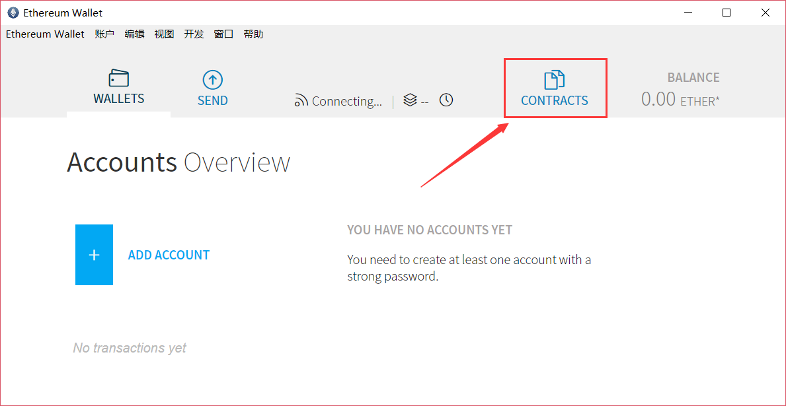
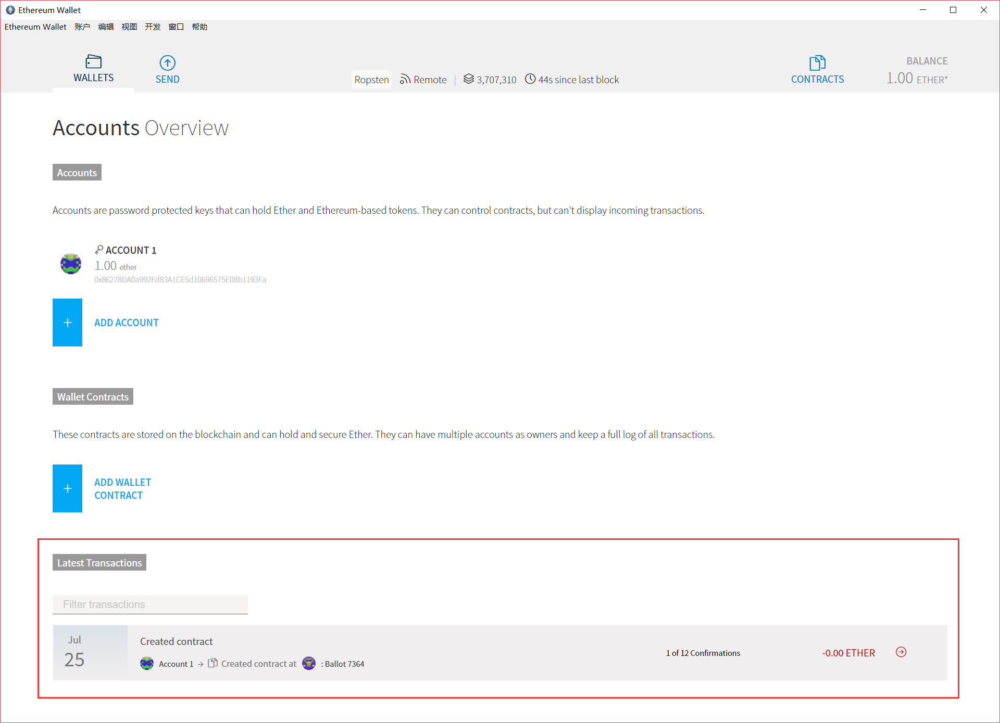
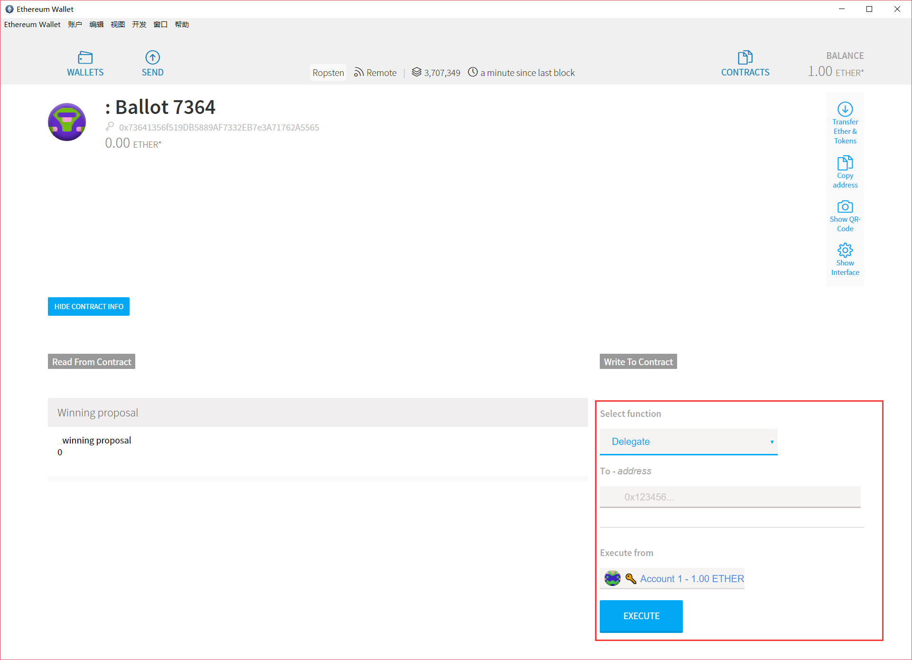
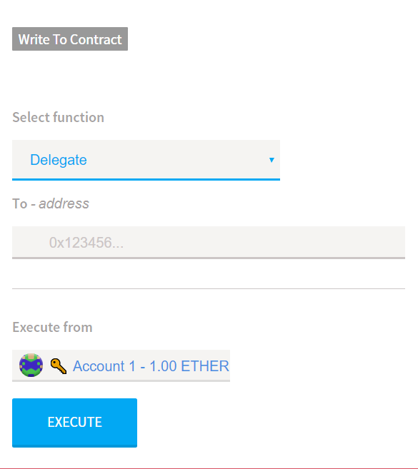

# 1. 以太坊智能合约：Ethereum Wallet

> https://github.com/ethereum/mist/releases/

<!-- TOC -->

- [1. 以太坊智能合约：Ethereum Wallet](#1-%E4%BB%A5%E5%A4%AA%E5%9D%8A%E6%99%BA%E8%83%BD%E5%90%88%E7%BA%A6%EF%BC%9Aethereum-wallet)
    - [1.1. 主界面](#11-%E4%B8%BB%E7%95%8C%E9%9D%A2)
    - [1.2. 网络选择](#12-%E7%BD%91%E7%BB%9C%E9%80%89%E6%8B%A9)
    - [1.3. 部署智能合约](#13-%E9%83%A8%E7%BD%B2%E6%99%BA%E8%83%BD%E5%90%88%E7%BA%A6)
    - [1.4. 执行智能合约](#14-%E6%89%A7%E8%A1%8C%E6%99%BA%E8%83%BD%E5%90%88%E7%BA%A6)

<!-- /TOC -->

## 1.1. 主界面

## 1.2. 网络选择

`Ethereum Wallet`支持将智能合约部署在**主网络**、**Ropsten测试网**、**Rinkeby测试网**：

## 1.3. 部署智能合约

`Ethereum Wallet`的智能合约部署界面，将编译与部署整合到了一个页面，整体比较美观：

选择账户`Account1`，将合约粘贴进去，`Ethereum Wallet`便会自动编译合约，并进行错误提示：

`Ethereum Wallet`提供了合约部署速率的选择进度条，能让用户方便地选择所期望的部署速率并自动计算出对应的`gas`:

部署确认窗口：

输入密码确认交易：

部署执行：

执行完成，返回到主界面，在下方显示合约部署的实际进度：

单击可查看合约的详细信息：

获得了1次确认：

获得了3次确认：

获得了22次确认：

在合约界面可以查看到已部署成功的合约：

## 1.4. 执行智能合约

点击已部署的合约进入合约方法的执行页面：

从方法列表中选择想要执行的合约方法：

参数输入窗口中有样例数据：

