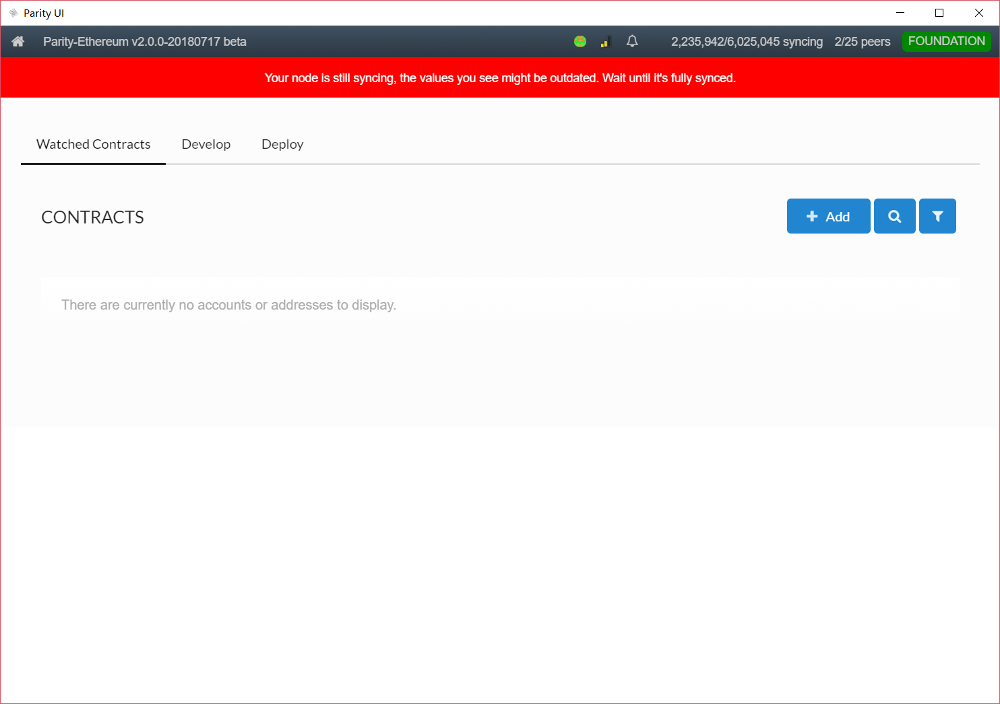

# 1. 以太坊智能合约：Parity

> https://www.parity.io/

<!-- TOC -->

- [1. 以太坊智能合约：Parity](#1-%E4%BB%A5%E5%A4%AA%E5%9D%8A%E6%99%BA%E8%83%BD%E5%90%88%E7%BA%A6%EF%BC%9Aparity)
    - [1.1. 主界面](#11-%E4%B8%BB%E7%95%8C%E9%9D%A2)
    - [1.2. 智能合约界面](#12-%E6%99%BA%E8%83%BD%E5%90%88%E7%BA%A6%E7%95%8C%E9%9D%A2)
    - [1.3. 智能合约编译](#13-%E6%99%BA%E8%83%BD%E5%90%88%E7%BA%A6%E7%BC%96%E8%AF%91)

<!-- /TOC -->

## 1.1. 主界面

## 1.2. 智能合约界面

`Parity`提供`solidity`编译器，支持：

- 可选编译器版本
- 代码优化

## 1.3. 智能合约编译

`Parity`支持对所用智能合约编译器的版本进行选择：

`Parity`编译完智能合约后会提供相应的`ABI`以及`Bytecode`:

`Parity`在部署智能合约时需要为智能合约设定**合约名**，还可以为智能合约添加描述（可选）以及标签（可选）：

成功部署的智能合约将以下图的形式展现：

