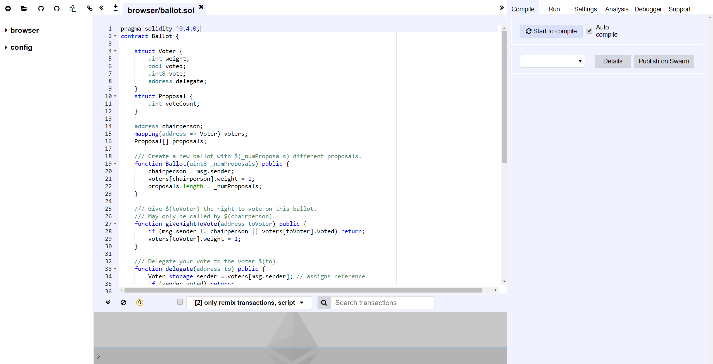
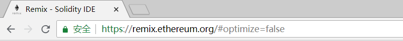
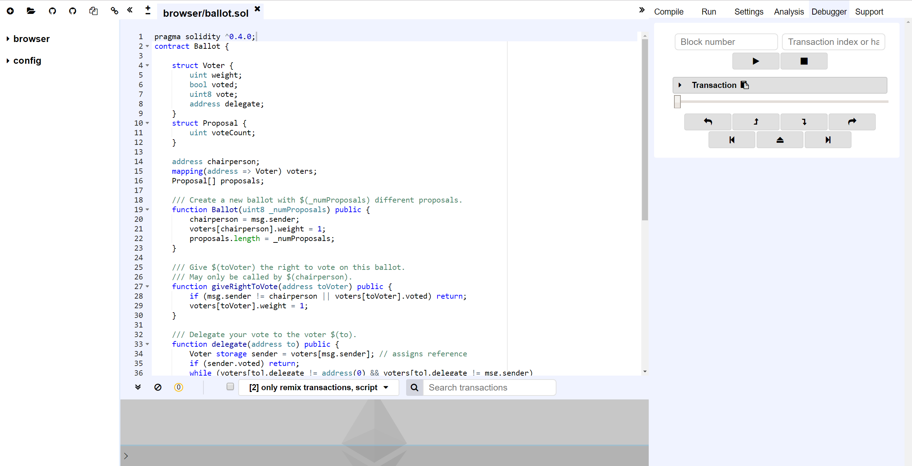
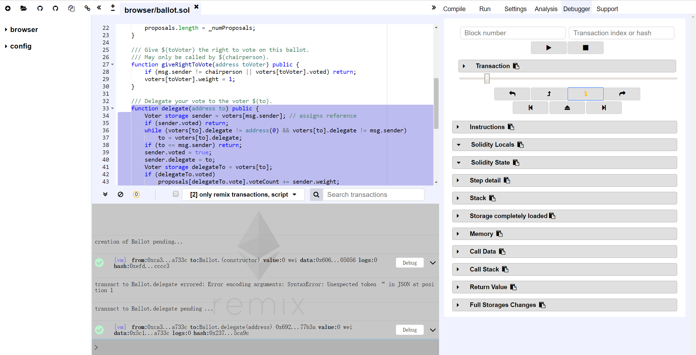
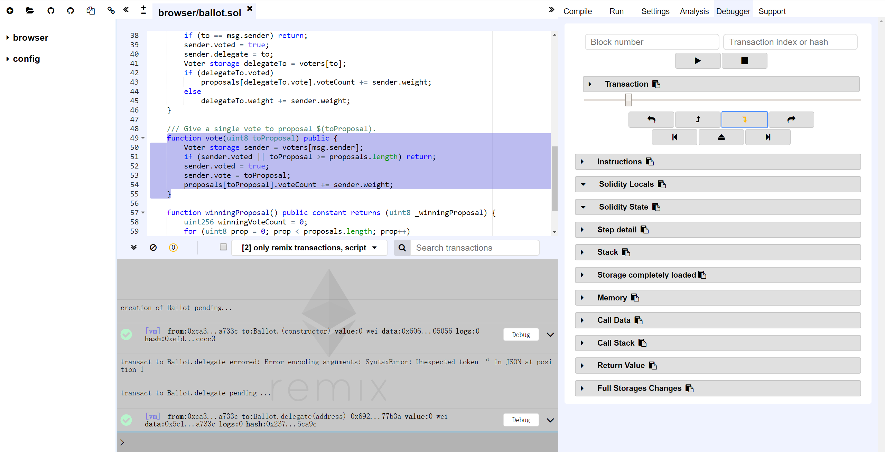
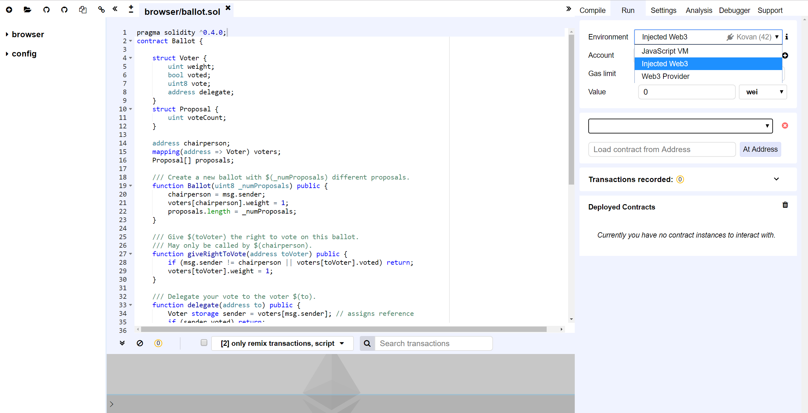
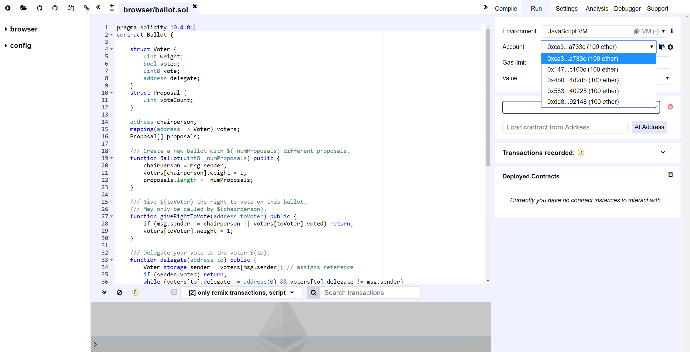
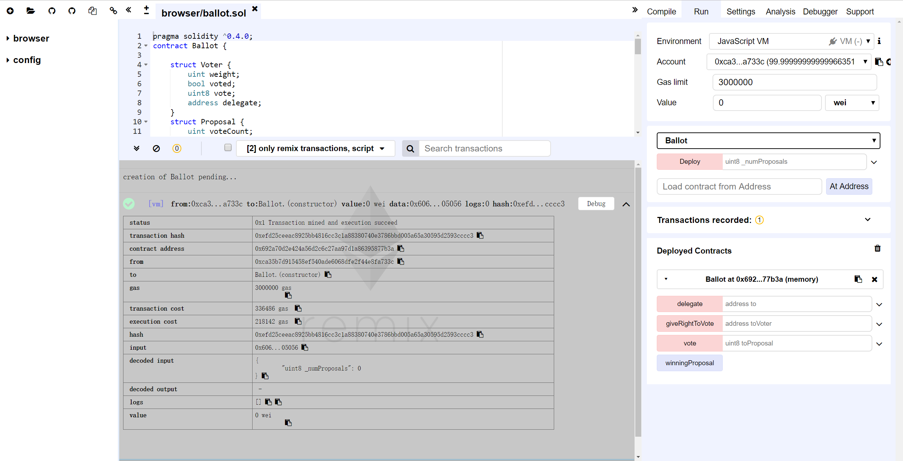
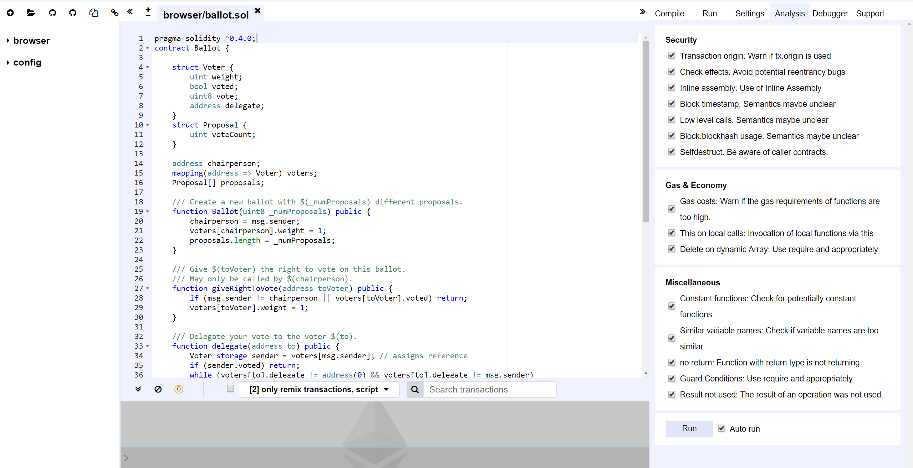

# 1. 以太坊智能合约：Remix

> https://remix.ethereum.org/

<!-- TOC -->

- [1. 以太坊智能合约：Remix](#1-以太坊智能合约remix)
    - [1.1. 主界面](#11-主界面)
    - [1.2. 支持HTTPS](#12-支持https)
    - [1.3. 智能合约调试](#13-智能合约调试)
    - [1.4. 智能合约运行](#14-智能合约运行)
    - [1.5. 智能合约分析](#15-智能合约分析)

<!-- /TOC -->

## 1.1. 主界面

## 1.2. 支持HTTPS

`Remix`已支持HTTPS：

> https://remix.ethereum.org/

## 1.3. 智能合约调试

## 1.4. 智能合约运行

`Remix`支持3种运行环境：

- **JavaScript VM**: All the transactions will be executed in a sandbox blockchain in the browser. This means nothing will be persisted and a page reload will restart a new blockchain from scratch, the old one will not be saved.

- **Injected Provider**: Remix will connect to an injected web3 provider. Mist and Metamask are example of providers that inject web3, thus can be used with this option.

- **Web3 Provider**: Remix will connect to a remote node. You will need to provide the URL address to the selected provider: geth, parity or any Ethereum client.

> 资料来源：https://remix.readthedocs.io/en/latest/run_tab.html

`Remix`提供`JavaScript VM`运行环境，支持在

## 1.5. 智能合约分析

