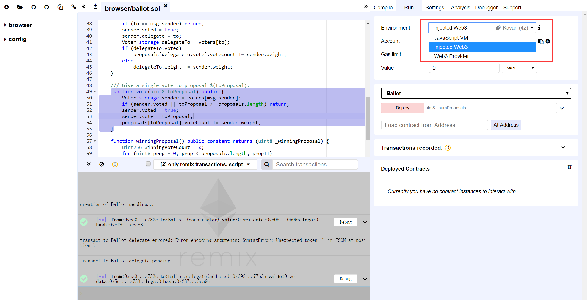
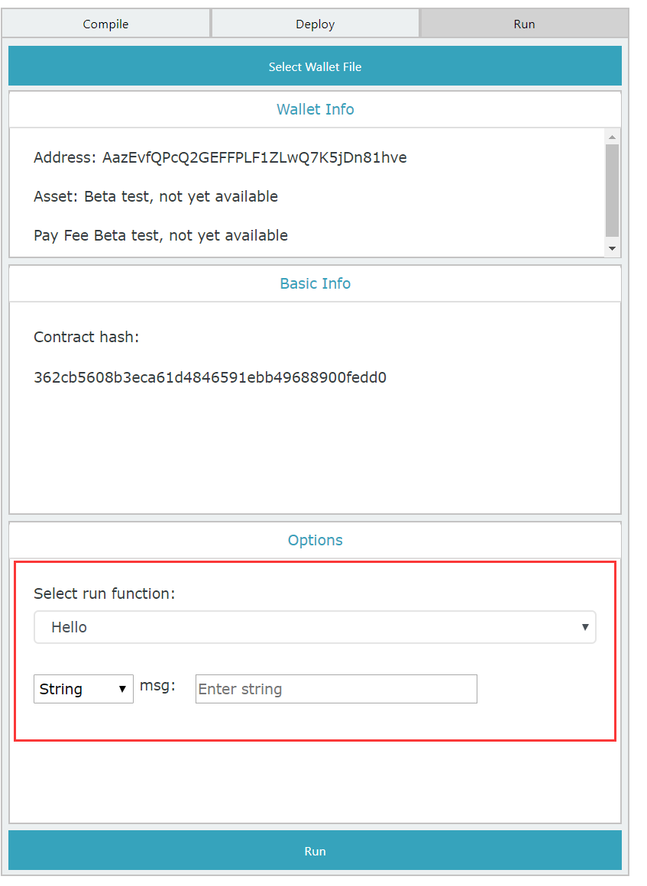
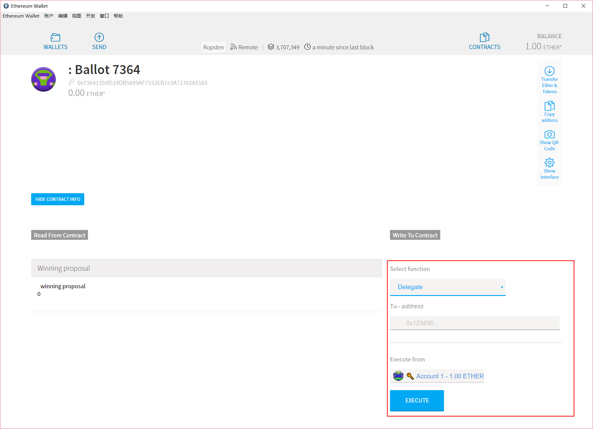
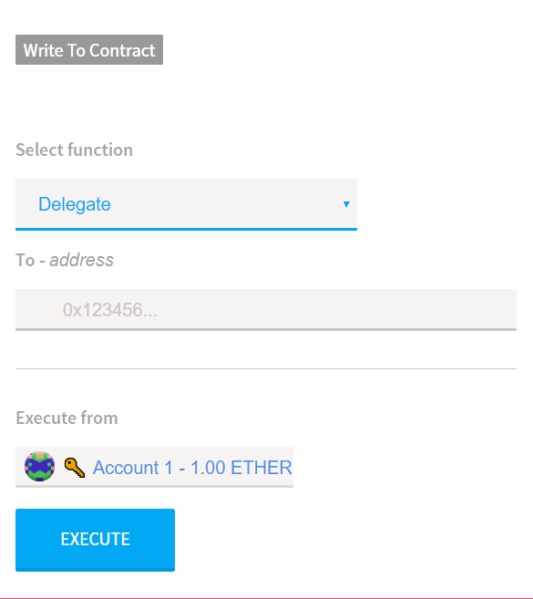

# 1. SmartX修改意见

<!-- TOC -->

- [1. SmartX修改意见](#1-smartx修改意见)
    - [1.1. 功能建议](#11-功能建议)
        - [1.1.1. 支持HTTPS](#111-支持https)
        - [1.1.2. 支持沙箱运行环境](#112-支持沙箱运行环境)
        - [1.1.3. 支持自定义运行环境](#113-支持自定义运行环境)
        - [1.1.4. 支持Debug](#114-支持debug)
    - [1.2. 界面建议](#12-界面建议)
        - [1.2.1. 优化日志显示](#121-优化日志显示)
        - [1.2.2. 可调节的窗格](#122-可调节的窗格)
        - [1.2.3. 方法参数窗口中提供样例数据](#123-方法参数窗口中提供样例数据)

<!-- /TOC -->

## 1.1. 功能建议

### 1.1.1. 支持HTTPS

`Remix`已支持HTTPS：

> https://remix.ethereum.org/

`SmartX`无论是正式版还是测试版都还未支持HTTPS：

> http://smartxbeta.ont.io/

> http://smartx.ont.io/

相较与`Remix`的无账户模式，基于钱包账户的`SmartX`使用HTTPS的必要性可能更高：

可以看到，在`Request Payload`中，可以直接找到登陆所用的`ontid`与对应的`password`：

### 1.1.2. 支持沙箱运行环境

在`Remix`中，提供了一种名为`JavaScript VM`的运行环境，能够使得所有的交易能够在浏览器中的沙箱区块链中被立即执行，对开发者非常友好。

### 1.1.3. 支持自定义运行环境

`Remix`所提供的`Injected Provider`环境或者`Web3 Provider`环境，将智能合约部署到自己搭建的以太坊区块链、在本机内存中模拟的以太坊区块链、以太坊测试网络`Rinkeby`、以太坊测试网络`Ropsten`等更多的区块链网络中。

`SmartX`目前只支持在`ontology`的测试网部署智能合约，未来会支持主网，但这对于开发者来说选择仍然非常有限，也不便于进行智能合约的开发。

### 1.1.4. 支持Debug

`SmartX`的定位是本体网络上的一站式智能合约`IDE`，但目前缺少`IDE`所应该具有的`Debug`功能，只能执行简单的编译、部署、运行：

`Remix`的定位是以太坊智能合约语言`solidity`的`IDE`，也相应地提供了`IDE`所应该具有的`Debug`功能：

## 1.2. 界面建议

### 1.2.1. 优化日志显示

`SmartX`的日志窗口中显示的是原始的信息，未经过优化：

`Remix`的日志窗口中显示的信息经过了优化，非常清晰：

### 1.2.2. 可调节的窗格

`SmartX`的窗格目前是固定的，在实际的智能合约开发过程中会带来不便：

`Remix`的窗格是可以调节的，在实际的智能合约开发过程中非常友好：

### 1.2.3. 方法参数窗口中提供样例数据

`SmartX`的方法参数窗口中目前是显示参数的数据类型：

实际上，窗口中的`Enter string`与左边的`String`已经重复了，可以参考`Ethereum Wallet`，将`Enter string`替换为示例数据，这样更加用户友好。

`Ethereum Wallet`的方法参数窗口中显示的是数据类型的样例数据：

如下图所示，`Delegate`方法的参数数据类型为`Address`，而用户所需要输入的数据格式应为`0x123456…`。

