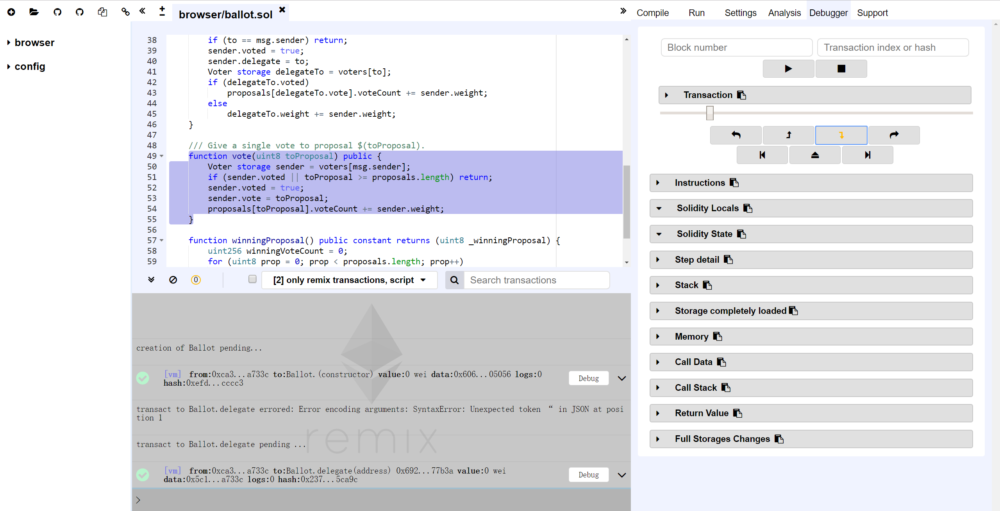
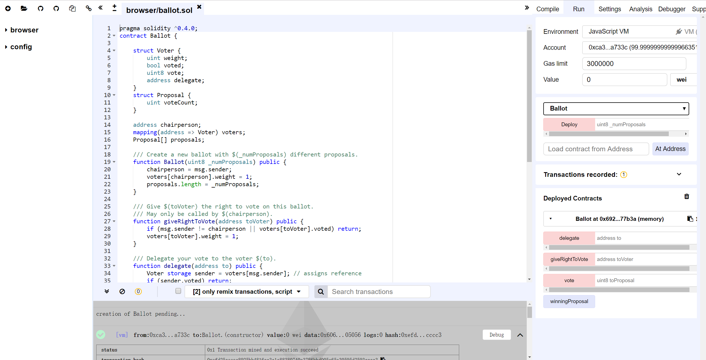

# 1. SmartX修改意见

<!-- TOC -->

- [1. SmartX修改意见](#1-smartx%E4%BF%AE%E6%94%B9%E6%84%8F%E8%A7%81)
    - [1.1. 功能建议](#11-%E5%8A%9F%E8%83%BD%E5%BB%BA%E8%AE%AE)
        - [1.1.1. 支持HTTPS](#111-%E6%94%AF%E6%8C%81https)
        - [1.1.2. 支持沙箱运行环境](#112-%E6%94%AF%E6%8C%81%E6%B2%99%E7%AE%B1%E8%BF%90%E8%A1%8C%E7%8E%AF%E5%A2%83)
        - [支持Debug](#%E6%94%AF%E6%8C%81debug)
    - [1.2. 界面建议](#12-%E7%95%8C%E9%9D%A2%E5%BB%BA%E8%AE%AE)
        - [1.2.1. 优化日志显示](#121-%E4%BC%98%E5%8C%96%E6%97%A5%E5%BF%97%E6%98%BE%E7%A4%BA)
        - [1.2.2. 可调节的窗格](#122-%E5%8F%AF%E8%B0%83%E8%8A%82%E7%9A%84%E7%AA%97%E6%A0%BC)

<!-- /TOC -->

## 1.1. 功能建议

### 1.1.1. 支持HTTPS

`Remix`已支持HTTPS：

> https://remix.ethereum.org/

`SmartX`无论是正式版还是测试版都还未支持HTTPS：

> http://smartxbeta.ont.io/

> http://smartx.ont.io/

相较与`Remix`的无账户模式，基于钱包账户的`SmartX`使用HTTPS的必要性可能更高：

### 1.1.2. 支持沙箱运行环境

在`Remix`中，提供了一种名为`JavaScript VM`的运行环境，能够使得所有的交易能够在浏览器中的沙箱区块链中被立即执行，对开发者非常友好。

### 支持Debug

`Remix`的定位是以太坊智能合约语言`solidity`的`IDE`，也相应地提供了`Debug`功能：

`SmartX`的定位是本体网络上的一站式智能合约IDE，但目前缺少IDE所应该具有的`Debug`功能，只能执行简单的编译、部署、运行：

## 1.2. 界面建议

### 1.2.1. 优化日志显示

`SmartX`的日志窗口中显示的是原始的信息，未经过优化：

`Remix`的日志窗口中显示的信息经过了优化，非常清晰：

### 1.2.2. 可调节的窗格

`Remix`的窗格是可以调节的，在实际的智能合约开发过程中非常友好：

`SmartX`的窗格目前是固定的，在实际的智能合约开发过充中会带来不便：

