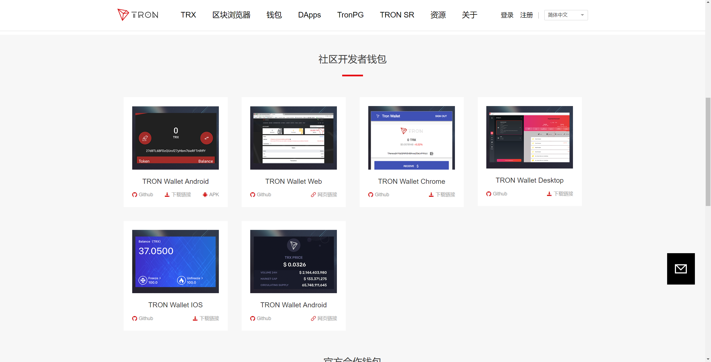
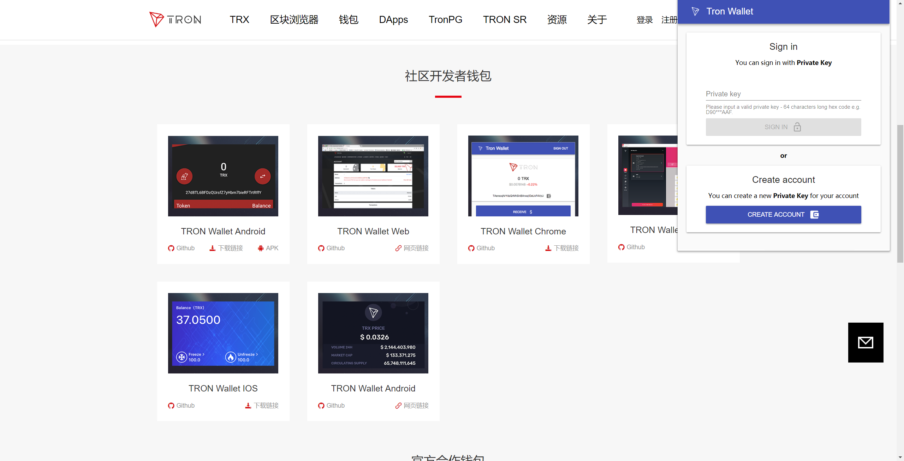
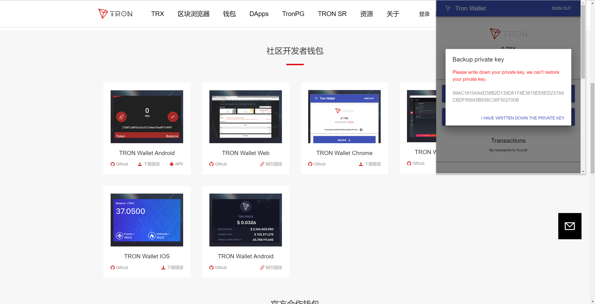
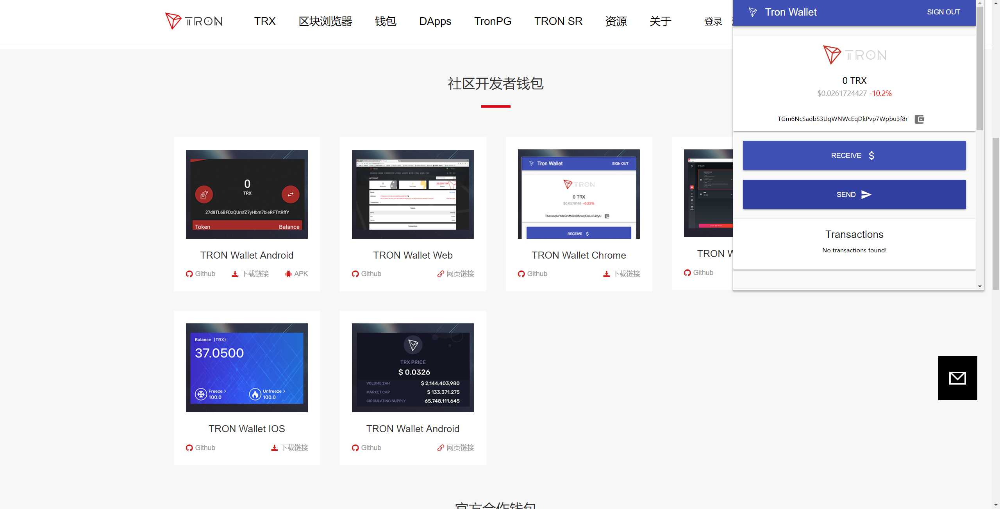

# TRON Extension

> https://tron.network/wallet?lng=zh

<!-- TOC -->

- [TRON Extension](#tron-extension)
    - [TRON钱包](#tron%E9%92%B1%E5%8C%85)
    - [TORN Extension源码](#torn-extension%E6%BA%90%E7%A0%81)
    - [Tronscan Client](#tronscan-client)
        - [Install the package](#install-the-package)
        - [Use the HTTP Client](#use-the-http-client)

<!-- /TOC -->

## TRON钱包









## TORN Extension源码

> https://github.com/jakeonchain/tron-wallet-chrome

```js
async loadPrice() {
const { data } = await xhr.get(`https://api.coinmarketcap.com/v1/ticker/tronix/`);
this.setState({ price: data[0] });
}
```

```js
async loadTransactions() {
if (this.state.address) {
    const { data } = await xhr.get(`https://api.tronscan.org/api/transfer?sort=-timestamp&count=true&limit=10&address=${this.state.address}`);
    this.setState({ transactions: data.data });
}
}
```

```js
const ONE_TRX = 1000000;
const CREATE_TOKEN_COST = 1024;
const client = new Client();
```

```js
sendToken = async () => {
const {sendTo, sendToken, sendAmount, privateKey, address} = this.state;
this.setState({ isLoading: true });

let amount = sendAmount;
if (sendToken === 'TRX') {
    amount = sendAmount * ONE_TRX;
}

const sendResult = await client.send(sendToken, address, sendTo, amount)(privateKey);
console.log(sendResult);
if (sendResult.success) {
    this.setState({
    isLoading: false,
    snackbarOpen: true,
    snackbarMessage: 'Succesfully sent tokens!',
    sendTo: '',
    sendAmount: '',
    }, () => {
    this.loadAccount();
    this.loadTransactions();
    setTimeout(()=> {
        this.loadAccount();
        this.loadTransactions();
    }, 1000)
    setTimeout(()=> {
        this.loadAccount();
        this.loadTransactions();
    }, 5000)
    setTimeout(()=> {
        this.loadAccount();
        this.loadTransactions();
    }, 10000)
    });
} else {
    this.setState({
    isLoading: false,
    snackbarOpen: true,
    snackbarMessage: `Sent failed, ${sendResult.message}, please retry later.`,
    });
}
};
```

## Tronscan Client

> https://github.com/jakeonchain/tronscan-node-client

### Install the package

> npm install @tronscan/client

### Use the HTTP Client

```js
import {Client} from "@tronscan/client";

const client = new Client();

let recentBlocks = await client.getBlocks({
  sort: '-number',
  limit: 10,
});
```